# Spire CLI — Architecture

## Overview

Spire is a manifest-driven scaffolding CLI written in Go. It solves three related problems:

1. **Project generation** — create a new application from a reusable template, filling in parameterised slots interactively or via flags.
2. **Project maintenance** — keep generated projects in sync with an evolving template through safe, backup-aware upgrades.
3. **Extensibility** — run custom compiled binary plugins at predefined lifecycle hook points, without modifying the CLI itself.

The tool is designed so a template author can publish a versioned Git repository and consumers can both generate fresh projects from it and upgrade their projects as the template evolves, all without losing local customisations.

---

## High-Level Architecture

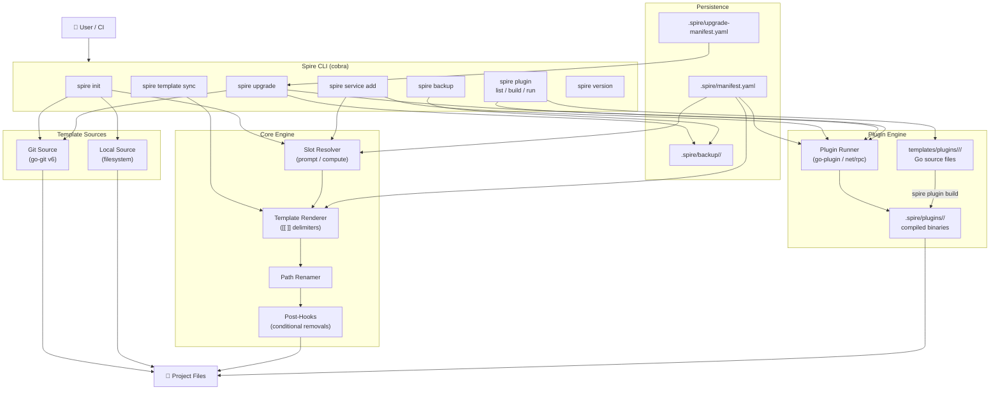

---

## Command Flow Diagrams

### `spire init` — Project Initialisation

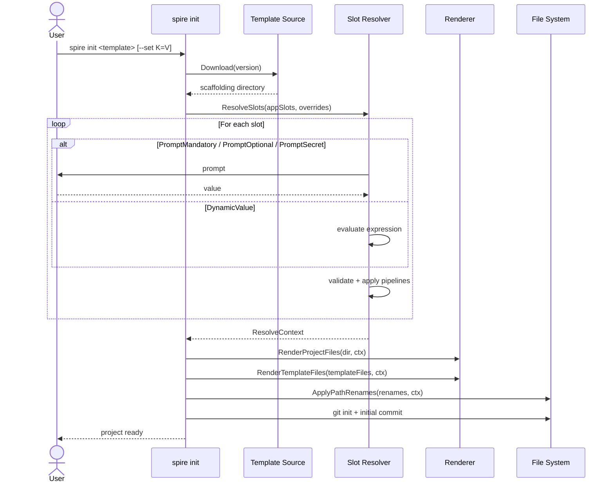

### `spire service add` — Service Addition

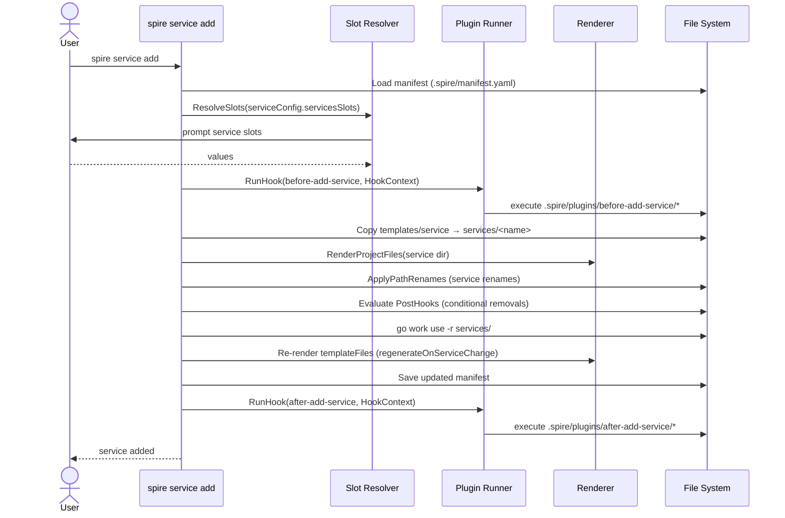

### `spire upgrade` — Template Upgrade

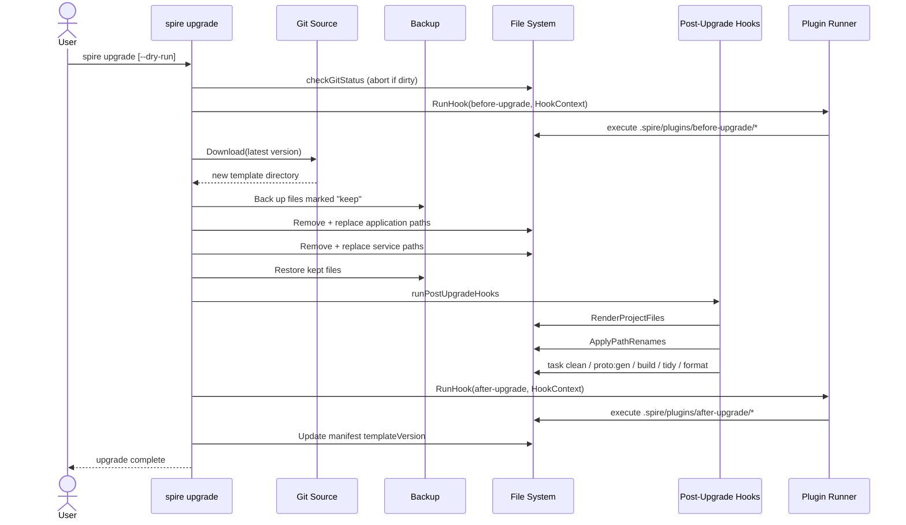

### `spire template sync` — Template Authoring

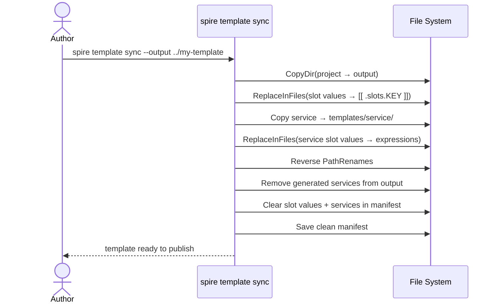

---

## Package Map

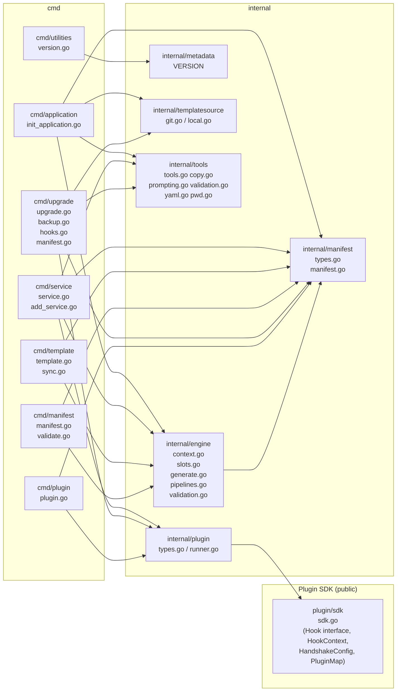

---

## Slot Resolution Pipeline

Each slot goes through a defined resolution pipeline before its value is stored in the `ResolveContext`.

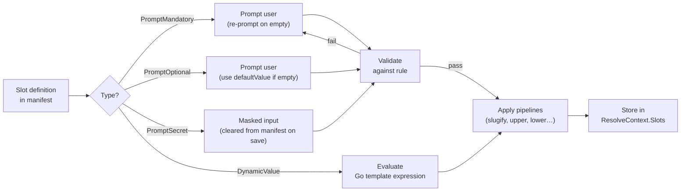

---

## Manifest Structure

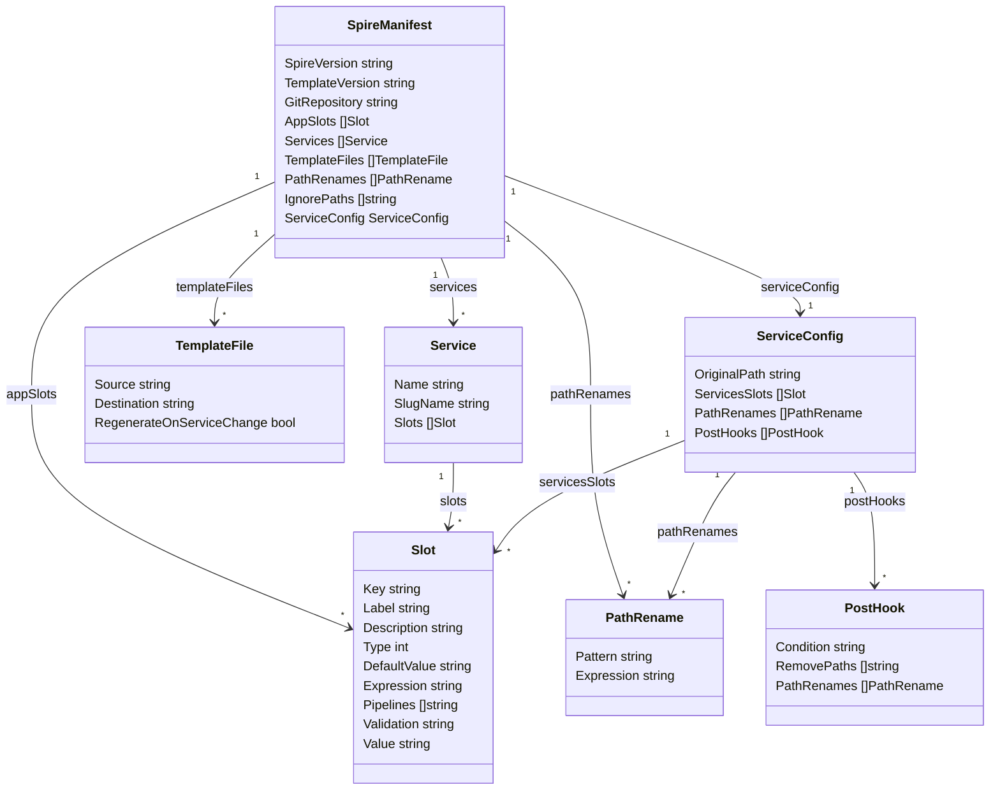

---

## Template Source Abstraction

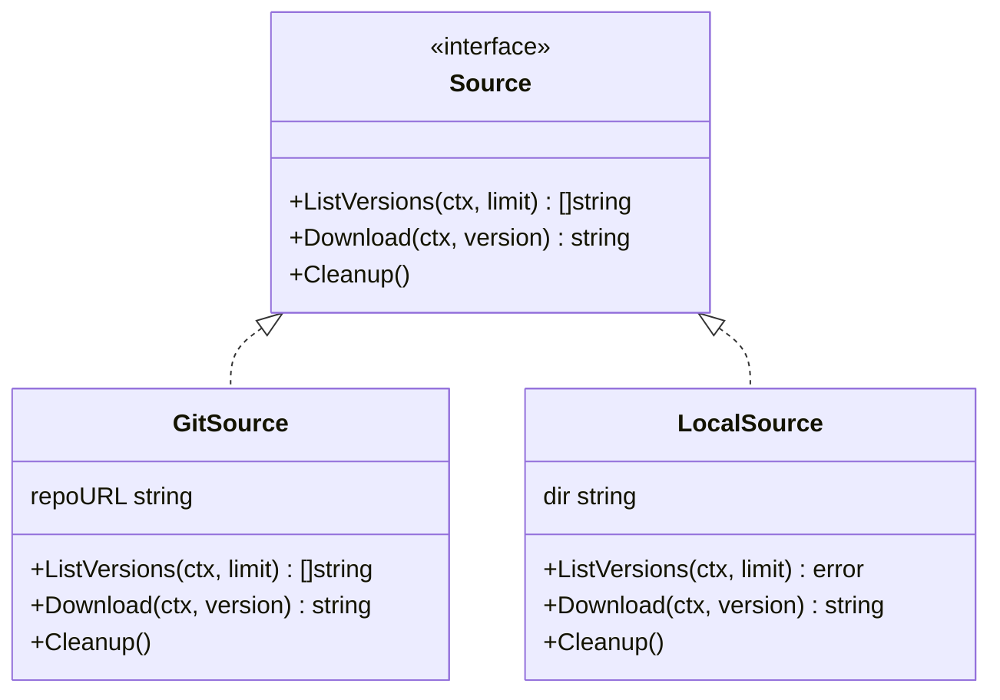

`GitSource` performs a shallow clone (`--depth 1`) of the requested tag using the user's existing Git credentials (SSH keys, credential helpers). It lists available versions by parsing `ls-remote` tags sorted by semantic version — no full clone required.

`LocalSource` returns the directory path directly and is used with `--template-local`.

---

## File Rendering Engine

All text files containing `[[ ]]` delimiters are processed as Go templates. Binary files and paths listed in `ignorePaths` are skipped.

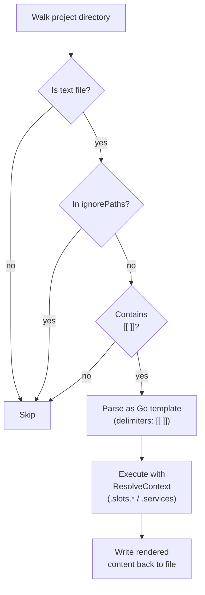

Pipeline functions available within templates:

| Function | Description |
|----------|-------------|
| `slugify` | Lowercase alphanumeric with hyphens |
| `pascalCase` | PascalCase |
| `camelCase` | camelCase |
| `snakeCase` | snake_case |
| `upper` / `lower` / `title` | Case conversion |
| `replace` | String replacement |
| `trimPrefix` / `trimSuffix` | Trim affixes |
| `ensureSuffix` | Append if not present |
| `split` / `join` | String splitting/joining |
| `contains` / `hasPrefix` / `hasSuffix` | Predicates |
| `repeat` | Repeat string N times |
| `default` | Fallback value |
| `generatePassword` | Random alphanumeric password; optional second arg `true` includes special characters |

---

## Upgrade Safety Model

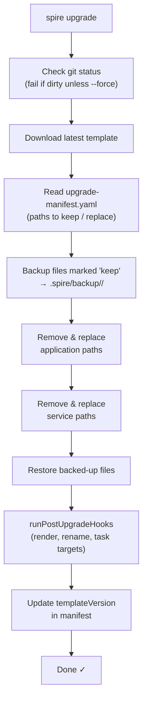

The backup system is independent (`spire backup create/restore/list/clean`) and can be used outside of upgrades for any checkpoint workflow.

---

## Key Design Decisions

| Decision | Rationale |
|----------|-----------|
| Custom `[[ ]]` delimiters | Avoids conflicts with `{{ }}` used by Helm, GitHub Actions, Bruno, and other tools that may be present in generated projects |
| Manifest-driven | A single `.spire/manifest.yaml` is the source of truth for slots, services, renames, and template files — no code changes needed to customise behaviour |
| Slot pipelines | Derived values (slugs, case variants) are computed from one canonical input, reducing the number of prompts and preventing inconsistencies |
| Reversible templates | `spire template sync` re-parameterises a living project back into a template, so the template can be maintained as a real working application |
| Shallow git clone | Only the requested tag is fetched, keeping network usage minimal even for large template repositories |
| Backup before upgrade | Files the user wants to customise are snapshotted before the upgrade replaces them, then restored — merging is not required |
| Compiled binary plugins | The Go native `plugin` package is Linux/macOS only. Compiled binary subprocesses managed by [HashiCorp go-plugin](https://github.com/hashicorp/go-plugin) (net/rpc) are fully cross-platform (including Windows), crash-safe, and independently versioned |
| Plugin sources in `templates/plugins/` | Plugin sources travel with the template and project so they can be rebuilt for any target OS with `spire plugin build`; `spire template sync` preserves them during round-trips |
